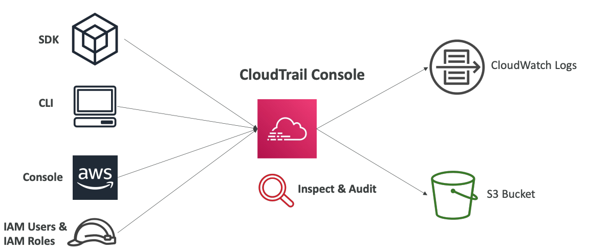

# CloudTrail

## Core Purpose

AWS CloudTrail serves as a critical governance, compliance, and auditing tool for AWS accounts. Enabled by default, it provides a comprehensive tracking mechanism for all activities within an AWS environment.

## Event Tracking Capabilities

CloudTrail captures a detailed history of events and API calls across multiple interaction channels, including the AWS Console, SDKs, CLI, and various AWS services. This extensive tracking allows organizations to maintain a complete record of account-level interactions and resource modifications.

## Event Types and Logging

### Management Events

Management events encompass operations performed on AWS resources, including critical activities such as:
- Security configuration modifications
- Data routing rule establishments
- Logging setup processes

These events are logged by default, with the ability to distinguish between read and write events. Read events represent non-modifying interactions, while write events capture potentially resource-altering actions.

### Data Events

By default, data events are not logged due to their high-volume nature. However, organizations can enable specific data event tracking for services like Amazon S3 and AWS Lambda. S3 data events can track object-level activities such as GetObject, DeleteObject, and PutObject, with options to separate read and write events.

## CloudTrail Insights

CloudTrail Insights provides advanced anomaly detection capabilities by:
- Analyzing normal management event patterns
- Continuously monitoring write events for unusual activities
- Detecting potential issues like inaccurate resource provisioning
- Identifying service limit breaches
- Tracking sudden bursts of IAM actions
- Recognizing gaps in periodic maintenance activities

When anomalies are detected, they appear in the CloudTrail console, generate events in Amazon S3, and create EventBridge events for potential automation.
It needs to be enabled and it's a paid service.

## Event Storage and Retention

CloudTrail maintains event records for 90 days within its native storage. For long-term preservation, organizations can configure logging to Amazon S3 and utilize Amazon Athena for extended event analysis.

## Practical Applications

CloudTrail is invaluable for forensic investigations, particularly when resources are unexpectedly deleted. By providing a comprehensive event trail, it enables detailed tracking and understanding of account-level activities.

## Flexible Configuration

Users can configure trails to cover all AWS regions or focus on specific regional activities, providing flexible monitoring options tailored to organizational needs.
