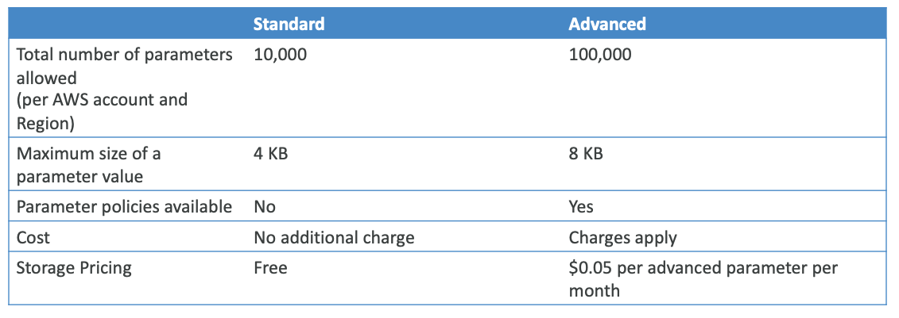

# Systems Manager Parameter Store (SSM)

## Overview

AWS Systems Manager Parameter Store offers a robust and secure service for configuration and secrets management. This centralized service provides a comprehensive solution for storing and managing configuration data, secrets, and other operational parameters within your AWS infrastructure.

## Core Features

### Secure Storage and Encryption

Parameter Store provides secure storage capabilities for both configuration data and sensitive information. The service seamlessly integrates with AWS Key Management Service (KMS), offering optional encryption capabilities to ensure the security of your stored parameters. This encryption integration allows organizations to maintain strict security standards while managing their configuration data.

### Architecture and Implementation

The service is built on a serverless architecture, eliminating the need for infrastructure management. It offers excellent scalability to accommodate growing parameter storage needs and ensures durability through AWS's reliable infrastructure. Developers can easily interact with Parameter Store through a well-designed SDK, making implementation straightforward across various applications and services.

### Version Control

Parameter Store maintains version tracking for all stored configurations and secrets. This versioning capability enables organizations to maintain a history of parameter changes, roll back to previous versions when needed, and audit configuration modifications over time.

### Security Framework

Security in Parameter Store is managed through AWS Identity and Access Management (IAM). This integration allows organizations to implement fine-grained access controls, ensuring that only authorized users and applications can access specific parameters. The IAM integration provides a robust security framework for managing access to sensitive configuration data.

### Integration Capabilities

The service features comprehensive integration with Amazon EventBridge, enabling automated notifications based on parameter changes or specific events. This integration allows organizations to build event-driven architectures and automated workflows around their configuration management processes.

Parameter Store also integrates seamlessly with AWS CloudFormation, enabling infrastructure as code practices and automated resource management. This integration allows organizations to include parameter management as part of their infrastructure deployment and management processes.

## Service Tiers

Parameter Store offers two distinct service tiers to accommodate different organizational needs:

### Standard Tier
The standard tier provides essential parameter management capabilities suitable for many applications and use cases.

### Advanced Tier
The advanced tier offers enhanced features and capabilities, including support for parameter policies and larger parameter values.

## Parameter Policies

Advanced parameters in Parameter Store can leverage parameter policies, which provide additional control and automation capabilities. These policies enable organizations to manage their parameters more effectively:

### Time-to-Live (TTL) Management
Parameter policies allow the assignment of expiration dates (TTL) to parameters. This capability is particularly valuable for managing sensitive data such as passwords, ensuring that such information is regularly updated or removed. The TTL functionality helps organizations maintain security compliance by forcing the update or deletion of sensitive parameters after a specified period.

### Policy Flexibility
Parameter Store supports the concurrent assignment of multiple policies to a single parameter. This flexibility allows organizations to implement complex parameter management strategies that combine different policy types to meet specific security and operational requirements.

## Best Practices

When implementing Parameter Store, consider these recommended practices:
- Implement appropriate encryption for sensitive parameters using KMS
- Establish clear naming conventions for parameters to maintain organization
- Utilize parameter policies for sensitive data management
- Configure EventBridge rules for critical parameter changes
- Implement proper IAM policies following the principle of least privilege

## Conclusion

AWS Systems Manager Parameter Store provides a comprehensive solution for configuration and secrets management, combining secure storage, version control, and integration capabilities with other AWS services. Its flexible tier structure and policy management features make it suitable for organizations of all sizes seeking to implement robust configuration management practices.
