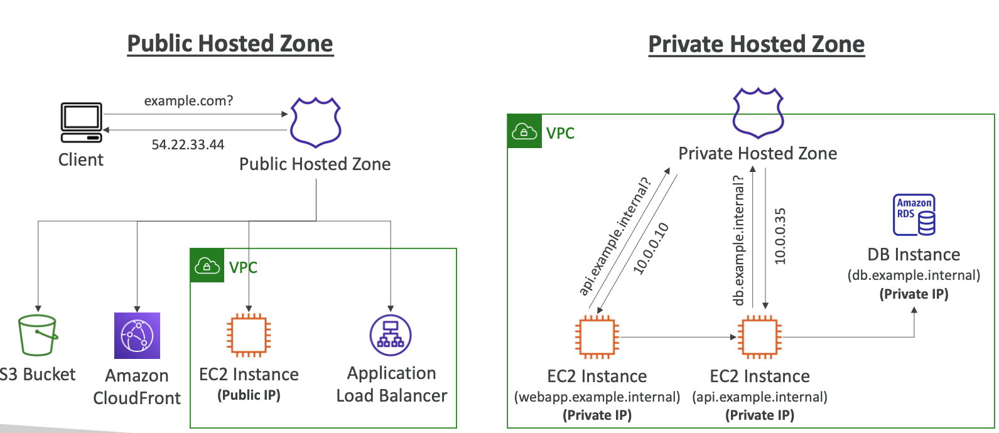

# Route 53

## Introduction to DNS and Route 53

Domain Name System (DNS) serves as the backbone of the Internet, functioning as a crucial translation mechanism that converts human-readable hostnames into machine-readable IP addresses. For instance, when you type www.google.com into your browser, DNS translates this into an IP address like 172.217.18.36.

The DNS hierarchical naming structure includes:

- .com
- example.com
- www.example.com
- api.example.com

Essential DNS terminology includes:

- Domain Registrar: Services like Amazon Route 53, GoDaddy
- DNS Records: A, AAAA, CNAME, NS, and others
- Zone File: Contains DNS records
- Name Server: Resolves DNS queries (Authoritative or Non-Authoritative)
- Top Level Domain (TLD): .com, .us, .in, .gov, .org
- Second Level Domain (SLD): amazon.com, google.com

## Understanding Route 53

Amazon Route 53 is AWS's premier DNS service, characterized by:

- Highly available, scalable, and fully managed Authoritative DNS
- Authoritative nature allowing customers to update DNS records
- Domain Registrar capabilities
- Resource health checking functionality
- The only AWS service with 100% availability SLA
- Name reference to the traditional DNS port (53)

## DNS Records in Route 53

Records define how traffic is routed for a domain. Each record contains:

- Domain/subdomain Name (e.g., example.com)
- Record Type (e.g., A or AAAA)
- Value (e.g., 12.34.56.78)
- Routing Policy
- TTL (Time to Live)

Supported DNS record types:

- Must-know types: A, AAAA, CNAME, NS
- Advanced types: CAA, DS, MX, NAPTR, PTR, SOA, TXT, SPF, SRV

Record Types in detail:

- A – maps a hostname to IPv4
- AAAA – maps a hostname to IPv6
- CNAME – maps a hostname to another hostname (cannot be used for zone apex)
- NS – Name Servers for the Hosted Zone

## Hosted Zones

Route 53 uses hosted zones as containers for records, costing $0.50 per month per hosted zone. Types include:
- Public Hosted Zones: For Internet traffic routing (e.g., application1.mypublicdomain.com)
- Private Hosted Zones: For VPC traffic routing (e.g., application1.company.internal)

## TTL Considerations

High TTL (e.g., 24 hr):

- Reduces Route 53 traffic
- May result in outdated records

Low TTL (e.g., 60 sec):

- Increases Route 53 traffic (higher cost)
- Records outdated for less time
- Facilitates easier record changes

TTL is mandatory for all DNS records except Alias records.

## CNAME versus Alias Records

For AWS Resources (Load Balancer, CloudFront) with AWS hostnames:

CNAME:

- Points hostname to any other hostname
- Only for non-root domain
- Cannot be used for zone apex

Alias:

- Points hostname to AWS Resource
- Works for both root and non-root domains
- Free of charge
- Includes native health check
- Always type A/AAAA for AWS resources
- No TTL setting required

Supported Alias Record Targets:

- Elastic Load Balancers
- CloudFront Distributions
- API Gateway
- Elastic Beanstalk environments
- S3 Websites
- VPC Interface Endpoints
- Global Accelerator
- Route 53 record in the same hosted zone
- Cannot target EC2 DNS names

## Routing Policies

Route 53 routing policies define DNS query responses, distinct from load balancer routing. Available policies include:

- Simple
- Weighted
- Failover
- Latency based
- Geolocation
- Multi-Value Answer
- Geoproximity (using Route 53 Traffic Flow)

### Simple Routing

- Routes traffic to a single resource
- Supports multiple values in one record
- Random value selection by client
- Single AWS resource when Alias enabled
- No Health Check association

### Weighted Routing

- Controls request percentage per resource
- Uses relative weight calculation: traffic % = (Weight for a specific record)/(Sum of all weights for all records)
- Weights don't need to sum to 100
- Requires same name and type for DNS records
- Supports Health Checks
- Useful for regional load balancing and application version testing
- Zero weight stops traffic to a resource

### Latency-based Routing

- Directs to lowest-latency resource
- Based on AWS Region-user latency
- Supports Health Checks with failover
- May direct users to unexpected regions based on latency

## Health Checks

Health Check types:

1. Endpoint monitoring
2. Calculated Health Checks (monitoring other health checks)
3. CloudWatch Alarm monitoring

Endpoint Monitoring Details:

- 15 global health checkers
- Default threshold: 3 (Healthy/Unhealthy)
- 30-second interval (10-second option available)
- Supports HTTP, HTTPS, TCP
- 18% healthy checker threshold
- Response must be 2xx or 3xx
- First 5120 bytes can determine pass/fail
- Requires firewall configuration for checker access

Calculated Health Checks:

- Combines multiple check results
- Supports OR, AND, NOT operations
- Up to 256 Child Health Checks
- Customizable pass threshold
- Useful for maintenance windows

Private Hosted Zone Health Checks:

- Checkers cannot access private endpoints
- Requires CloudWatch Metric and Alarm integration

## Routing Policies (Continued)

### Geolocation

- Location-based (not latency-based)
- Supports Continent, Country, US State targeting
- Requires default record
- Ideal for content localization
- Supports Health Checks

### Geoproximity

- Based on resource and user locations
- Adjustable bias values (-99 to +99)
- Supports AWS and non-AWS resources
- Requires Route 53 Traffic Flow

### IP-based Routing

- Routes based on client IP addresses
- Requires CIDR list and endpoint mappings
- Optimizes performance and costs

### Multi-Value

- Routes to multiple resources
- Returns up to 8 healthy records
- Supports Health Checks
- Not a load balancer replacement

## Domain Registration and DNS Service

Domain registration and DNS service can be separated:

- Annual domain registration with registrars
- DNS service choice is independent
- Route 53 can manage DNS for third-party registered domains

Third-party domain integration steps:

1. Create Route 53 Hosted Zone
2. Update NS Records on third-party site
3. Use Route 53's name servers

## Traffic Flow

Traffic flow features:

- Visual editor for complex configurations
- Saveable Traffic Flow Policies
- Cross-zone policy application
- Version control support
