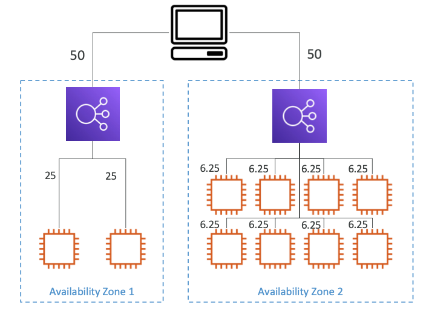

# Elastic Load Balancer

## Introduction to Elastic Load Balancer

An Elastic Load Balancer (ELB) is AWS's managed load balancing solution that provides guaranteed operational reliability through AWS's maintenance, upgrades, and high availability management. While setting up a custom load balancer might be more cost-effective initially, ELB offers significant advantages through its deep integration with AWS services including EC2, EC2 Auto Scaling Groups, Amazon ECS, AWS Certificate Manager (ACM), CloudWatch, Route 53, AWS WAF, and AWS Global Accelerator.

## Health Check Mechanisms

Health checks are fundamental to load balancer operations, enabling the service to verify the availability of instances receiving traffic. These checks typically monitor a specific port and route (commonly /health), with instances being marked as unhealthy if they fail to return a 200 (OK) response.

## Load Balancer Types

AWS offers four distinct managed load balancer types, each designed for specific use cases:

### Classic Load Balancer (CLB - 2009)
The first-generation load balancer supports HTTP, HTTPS, TCP, and SSL protocols. It provides TCP (Layer 4) and HTTP/HTTPS (Layer 7) load balancing with TCP or HTTP-based health checks. CLBs are assigned a fixed hostname in the format XXX.region.elb.amazonaws.com.

### Application Load Balancer (ALB - 2016)
Operating at Layer 7, ALB specializes in HTTP-based traffic management with support for HTTP/2 and WebSocket. It enables sophisticated routing to multiple applications through target groups, supporting path-based routing (/users, /posts), hostname-based routing (one.example.com, other.example.com), and query string/header-based routing (example.com/users?id=123&order=false).

ALB is particularly well-suited for microservices and container-based applications, offering dynamic port mapping for ECS. This represents a significant advantage over Classic Load Balancers, which would require multiple instances for similar functionality.

ALB Target Groups can include:

- EC2 instances managed by Auto Scaling Groups (HTTP)
- ECS tasks (HTTP)
- Lambda functions (HTTP requests are converted to JSON events)
- Private IP addresses

Additional ALB features include:

- Fixed hostname (XXX.region.elb.amazonaws.com)
- Client IP preservation through X-Forwarded-For header
- Port and protocol information through X-Forwarded-Port and X-Forwarded-Proto headers

### Network Load Balancer (NLB - 2017)
NLB operates at Layer 4, handling TCP, TLS, and UDP traffic. It excels in high-performance scenarios, processing millions of requests per second with ultra-low latency. NLB provides static IP addresses per Availability Zone and supports Elastic IP assignment, making it ideal for IP whitelisting scenarios. Note that NLB is not included in the AWS free tier.

NLB Target Groups can include:

- EC2 instances
- Private IP addresses
- Application Load Balancers

Health checks support TCP, HTTP, and HTTPS protocols.

### Gateway Load Balancer (GWLB - 2020)
GWLB operates at Layer 3 (Network layer) using the GENEVE protocol on port 6081. It's designed for managing third-party network virtual appliances such as firewalls, intrusion detection systems, and deep packet inspection systems. GWLB combines transparent network gateway functionality with load balancing capabilities.

GWLB Target Groups support:

- EC2 instances
- Private IP addresses

## Advanced Load Balancer Features

### Sticky Sessions
Sticky sessions (session affinity) ensure that clients are consistently directed to the same backend instance. This feature is available across all load balancer types, with cookie-based stickiness control for CLB and ALB. While useful for session maintenance, sticky sessions may create uneven load distribution.

Cookie types and naming conventions include:

1. Application-based Cookies:

   - Custom cookie:
     - Generated by the target
     - Can include any custom attributes required by the application
     - Cookie name must be specified individually for each target group
     - Must avoid reserved names: AWSALB, AWSALBAPP, or AWSALBTG (reserved for ELB use)
   - Application cookie:
     - Generated by the load balancer
     - Uses the cookie name AWSALBAPP

2. Duration-based Cookies:

   - Generated by the load balancer
   - Uses specific names depending on the load balancer type:
     - AWSALB for Application Load Balancer
     - AWSELB for Classic Load Balancer

### Cross-Zone Load Balancing
Cross-zone load balancing enables even distribution of traffic across all registered instances in all Availability Zones. 

Without cross-zone load balancing, requests are distributed only to instances within the load balancer node's Availability Zone. 

The feature's default state and associated costs vary by load balancer type:

- ALB: Enabled by default, no inter-AZ charges
- NLB and GWLB: Disabled by default, inter-AZ charges apply when enabled
- CLB: Disabled by default, no inter-AZ charges when enabled

### SSL/TLS Certification
Load balancers support SSL/TLS certificates for in-transit encryption, managed through AWS Certificate Manager (ACM) or manual upload. SSL certificates are issued by Certificate Authorities (CA) such as Comodo, Symantec, GoDaddy, GlobalSign, Digicert, and Letsencrypt. Certificates follow the X.509 standard and must be renewed before expiration.

HTTPS listeners require:

- A default certificate
- Optional additional certificates for multiple domains
- A security policy to support older versions of SSL/TLS for legacy clients

Server Name Indication (SNI) allows loading multiple SSL certificates onto one web server. This newer protocol requires clients to specify the target hostname during the initial SSL handshake. SNI is supported by ALB, NLB, and CloudFront, but not by CLB.

SSL Certificate support by load balancer type:

- CLB: Supports only one SSL certificate
- ALB and NLB: Support multiple listeners with multiple SSL certificates using SNI

### Connection Draining
Connection draining (known as Deregistration Delay for ALB and NLB) allows in-flight requests to complete while an instance is being de-registered or marked unhealthy. This feature can be configured from 1 to 3600 seconds (default 300) or disabled completely. It's recommended to use shorter values for applications with quick request processing times.

## Security Considerations

Load balancer security groups play a crucial role in controlling traffic flow. They should be configured to allow only necessary incoming traffic to the load balancer while permitting all outbound traffic to instance security groups. Instance security groups should be configured to accept traffic only from the load balancer's security group, creating a secure chain of trust.

