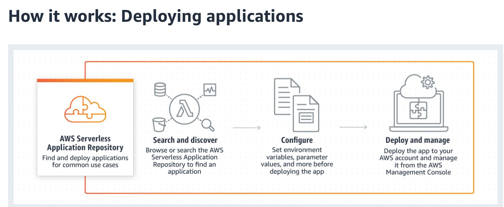

# Serverless Application Repository (SAR)

The AWS Serverless Application Repository is a managed repository for serverless applications. It enables teams, organizations, and individual developers to store and share reusable applications, and easily assemble and deploy serverless architectures in powerful new ways. Using the Serverless Application Repository, you don't need to clone, build, package, or publish source code to AWS before deploying it. Instead, you can use pre-built applications from the Serverless Application Repository in your serverless architectures, helping you and your teams reduce duplicated work, ensure organizational best practices, and get to market faster. Integration with AWS Identity and Access Management (IAM) provides resource-level control of each application, enabling you to publicly share applications with everyone or privately share them with specific AWS accounts.

