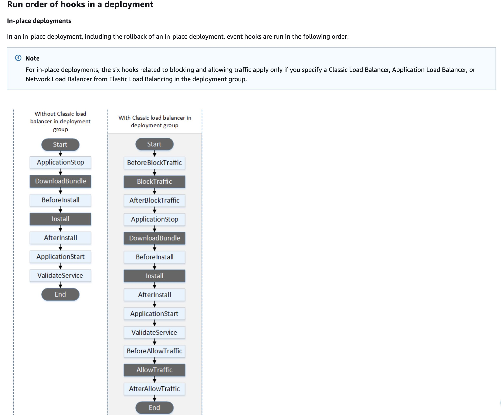

# CodeDeploy

## Service Overview
AWS CodeDeploy is a robust deployment automation service designed to streamline application version deployments across diverse computing environments. It supports deployment to EC2 instances, on-premises servers, Lambda functions, and ECS services with sophisticated deployment control mechanisms.

## Core Deployment Capabilities
The service enables automated application deployments with built-in rollback capabilities, triggered either by deployment failures or CloudWatch Alarm conditions. Deployments are orchestrated through an `appspec.yml` configuration file, which defines precise deployment procedures.

## Core Concepts

### 1. Deployment Components

#### Application
- Container for deployment rules, configurations, and files
- Groups related deployment resources
- Can contain multiple deployment groups

#### Deployment Group
- Set of tagged instances
- Deployment rules and success conditions
- Deployment configuration
- Rollback configuration
- Triggers and alarms

#### Deployment Configuration
- Rules for deployment success/failure
- Traffic shifting rules
- Instance health evaluation

#### Revision
- Source content to deploy
- AppSpec file
- Application files
- Scripts
- Configuration files

### 2. AppSpec File

The AppSpec file (application specification file) is the core of CodeDeploy deployment.

#### Structure
```yaml
version: 0.0
os: linux
files:
  - source: /
    destination: /var/www/html/
hooks:
  ApplicationStop:
    - location: scripts/application_stop.sh
      timeout: 300
      runas: root
  BeforeInstall:
    - location: scripts/before_install.sh
      timeout: 300
      runas: root
  AfterInstall:
    - location: scripts/after_install.sh
      timeout: 300
      runas: root
  ApplicationStart:
    - location: scripts/start_application.sh
      timeout: 300
      runas: root
  ValidateService:
    - location: scripts/validate_service.sh
      timeout: 300
      runas: root
```

#### Lifecycle Events
1. **Application Stop**
   - Stop running version
   - Prepare for deployment

2. **Download Bundle**
   - Download revision files
   - Validate checksums

3. **Before Install**
   - Pre-installation tasks
   - Backup existing files
   - Decrypt files

4. **Install**
   - Copy revision files
   - Set permissions
   - Create directories

5. **After Install**
   - Configuration tasks
   - Set environment variables
   - File modifications

6. **Application Start**
   - Start application
   - Enable services
   - Start servers

7. **Validate Service**
   - Health checks
   - Test functionality
   - Verify deployment



## Deployment Types

### 1. In-Place Deployment
- Updates existing instances
- Sequential deployment
- Possible downtime
- Rollback replaces files

#### Use Cases
- Small applications
- Development environments
- Quick updates

### 2. Blue/Green Deployment
- New instance group
- Zero downtime
- Easy rollback
- Higher resource usage

## Deployment Platforms and Strategies

### EC2 and On-Premises Deployments
CodeDeploy supports comprehensive deployment approaches for traditional server environments, including:

#### Deployment Speed Configurations
- AllAtOnce: Fastest deployment with maximum potential downtime
- HalfAtATime: Reduces infrastructure capacity by 50%
- OneAtATime: Slowest method with minimal availability impact
- Custom: Percentage-based deployment control

#### Deployment Types
- In-Place Deployment: Updates existing infrastructure directly
- Blue/Green Deployment: Creates parallel infrastructure for zero-downtime transitions

### Lambda Function Deployments
CodeDeploy offers sophisticated traffic shifting mechanisms for Lambda functions:

#### Traffic Shift Strategies
- Linear Approaches: Gradual traffic increase over specified intervals
- Canary Deployments: Controlled percentage testing before full rollout
- Immediate Deployment: Instantaneous full traffic shift

### ECS Service Deployments
Specialized deployment automation for containerized applications:

#### Deployment Patterns
- Blue/Green Deployments exclusively
- Linear and Canary traffic shifting
- Immediate deployment options

## Agent and Permissions

### CodeDeploy Agent
A prerequisite agent must run on target EC2 instances, with:
- Automatic installation via Systems Manager
- Permissions to access deployment artifacts from Amazon S3

## Advanced Deployment Features

### Auto Scaling Group Integration
- Supports in-place and blue/green deployments
- Automated deployment for newly created instances
- Configurable old infrastructure retention

### Rollback Mechanisms
- Automatic rollback on deployment failure
- Manual rollback capabilities
- Deployment of last known good revision
- CloudWatch Alarm-triggered rollbacks

## Deployment Configuration
Deployments are defined through `appspec.yml`, specifying:
- Deployment targets
- Artifact locations
- Execution hooks
- Validation procedures

## Conclusion
AWS CodeDeploy provides a comprehensive, flexible deployment automation solution supporting multiple platforms and sophisticated deployment strategies.
